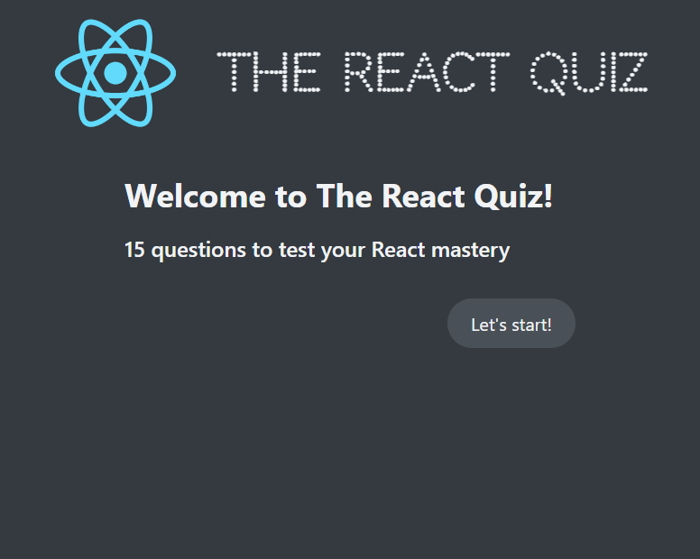
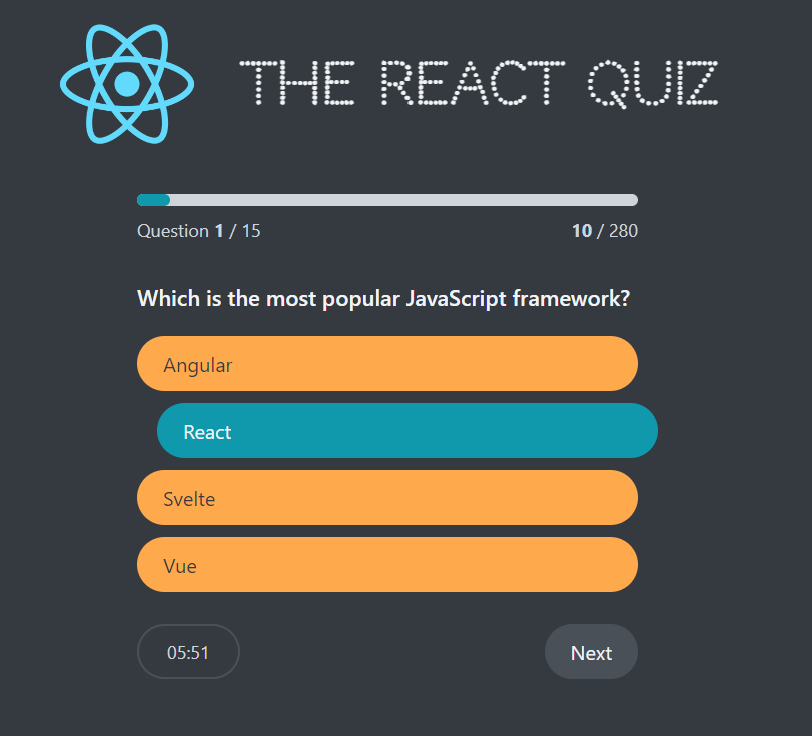
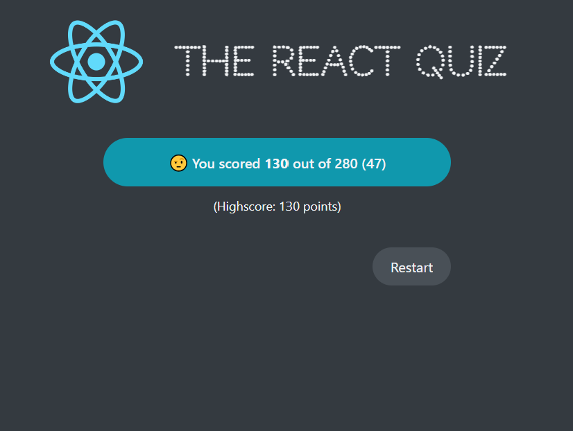

# Getting Started with React Quiz App

This project was bootstrapped with [Create React App](https://github.com/facebook/create-react-app). This document presents the React Quiz App, designed to test knowledge in React. The app offers a dynamic and engaging way to check your understanding and learn new facts.

## Demo Images

### Start Screen

The start screen welcomes users and provides a button to begin the quiz.

### Quiz Active

During the quiz, questions are presented one at a time with multiple choice answers. A timer counts down the remaining time.

### Quiz Finished

After completing the quiz, users can see their scores, and choose to either retake the quiz.

## How to Use

To start the quiz, simply click the 'Start' button. Answer each question before the timer runs out. After the last question, your score will be displayed.

## Features

- Timed questions
- Instant feedback on answers
- Score sharing

## Available Scripts

In the project directory, you can run:

### `npm start`

Runs the app in the development mode.\
Open [http://localhost:3000](http://localhost:3000) to view it in your browser.

The page will reload when you make changes.\
You may also see any lint errors in the console.
